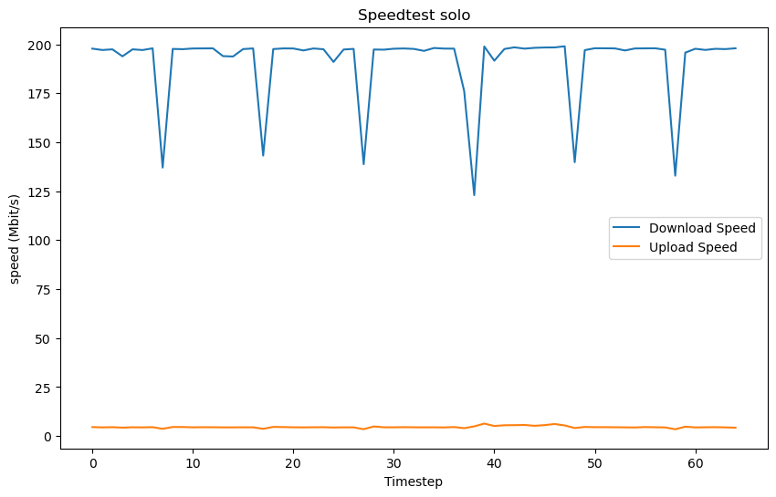

# Исследование скорости передачи файлов по Wi-Fi в зависимости от загрузки радиоэфира
## Краткое описание предстоящей работы

В этом исследовании мы выясним как загрузка радиоэфира влияет на скорость Wi-Fi-соединения. В начале мы проведём измерения базовой скорости передачи данных без какой-либо дополнительной нагрузки на сеть. Затем внесём дополнительную активность, представленную трафиком ещё одного хоста, и повторно измерим скорость передачи данных. Финальным этапом будет анализ и сравнение полученных результатов.

# Описание экспериментального стенда, среды и условий проведения эксперимента
<center><p>Рис. 1 - Расположение устройств, участвующих в эксперименте</center>

Экспериментальный стенд состоит из трёх компонентов:
1. Wi-fi роутер tp-link EC220-G5 V3
2. Настольный ПК с ОС Linux
3. Ноутбук с ОС Linux

Все три устройства размещены в одном помещении (рис. 1). Стены, показанные на рисунке, имеют толщину не более 10см, внутри полые. Само помещение - квартира многоэтажного дома. Параметры комнаты - 6.5 на 7 метров. Всего в квартире можно поймать сигнал ~10 точек доступа. Эксперимент проводится в понедельник, в 4 часа утра, когда нагрузка на общедомовую сеть минимальна.

Рассмотрим все три устройства подробнее:


## Wi-Fi роутер
Wi-Fi-роутер `tp-link EC220-G5 V3`. Из документации, приведённой на официальном сайте, узнаём следующие характеристики:
```
Стандарты Wi-Fi:
    2,4 ГГц: IEEE 802.11b/g/n  
    5 ГГц: IEEE 802.11a/n/ac  
    IEEE 802.11k/v  
Скороcть передачи:
    2,4 ГГц: до 300 Мбит/с
    5 ГГц: до 867 Мбит/с
ЭИИМ:
    До 20 дБм или до 100 мВт

4 внешние антенны
```
### Интернет-провайдер
В качестве интернет-провайдера выступает компания "SkyNet". Заявляенная скорость соединения - до 200 Мбит/с. Роутер соединен с сетью 8-жильной витой парой. 

Через админ-панель роутера узнаём SSID:"MoorMoor_5G" и "MoorMoor_2.4G"   

К тому же убеждаемся, что сейчас к сети подключены только те устройства, которые будут участвовать в эксперименте - ноутбук и компьютер.

## Настольный ПК
**Краткое описание:** настольный компьютер, с сетевой картой, интегрированной в материнскую плату. Операционная система - Ubuntu 23.10. Подключение к сети осуществляется через Wi-Fi.


### Сбор информации о хосте
Рассмотрим характеристики сетевого интерфейса, полученные с помощью команды `lshw -C network`:
```
Wireless interface
          product: MT7922 802.11ax PCI Express Wireless Network Adapter
          vendor: MEDIATEK Corp.
          logical name: wlp11s0
```

А также характеристики самого подключения, командой `iwconfig wlp11s0`:
```
wlp11s0   IEEE 802.11  ESSID:"MoorMoor_5G"  
          Mode:Managed  Frequency:5.18 GHz  Access Point: 78:8C:B5:DC:9B:08   
          Bit Rate=866.7 Mb/s   Tx-Power=3 dBm   
          Retry short limit:7   RTS thr:off   Fragment thr:off
          Power Management:on
          Link Quality=63/70  Signal level=-47 dBm  
          Rx invalid nwid:0  Rx invalid crypt:0  Rx invalid frag:0
          Tx excessive retries:0  Invalid misc:0   Missed beacon:0

```

### Полученные характеристики:

Сетевой интерфейс ПК идентифицируется как wlp11s0. Он подключен к беспроводной сети на частоте **5.18 ГГц** (используется стандарт **IEEE 802.11ac**), с максимальной скоростью передачи данных **866.7 Mb/s**. **Уровень сигнала -47 dBm**. **Мощность передачи 3 dBm**,

## Ноутбук
**Краткое описание:** ноутбук с сетевой картой, интегрированной в материнскую плату. Операционная система - Ubuntu 23.10. Подключение к сети осуществляется через Wi-Fi.
### Сбор информации о хосте
Аналогично тому, как мы собирали информацию о характеристиках ПК, для ноутбука получаем:
```
>>lshw -C network
...
wlp2s0    IEEE 802.11  ESSID:"MoorMoor_5G"  
          Mode:Managed  Frequency:5.18 GHz  Access Point: 78:8C:B5:DC:9B:08   
          Bit Rate=585 Mb/s   Tx-Power=20 dBm   
          Retry short limit:7   RTS thr:off   Fragment thr:off
          Power Management:on
          Link Quality=62/70  Signal level=-48 dBm  
          Rx invalid nwid:0  Rx invalid crypt:0  Rx invalid frag:0
          Tx excessive retries:0  Invalid misc:1   Missed beacon:0
```

```
>> iwconfig wlp11s0
...
Wireless interface
       product: RTL8822CE 802.11ac PCIe Wireless Network Adapter
       vendor: Realtek Semiconductor Co., Ltd.
       physical id: 0
       bus info: pci@0000:02:00.0
       logical name: wlp2s0
       version: 00
       serial: d8:12:65:e4:44:cf
       width: 64 bits
       clock: 33MHz
       capabilities: pm msi pciexpress bus_master cap_list ethernet physical wireless
```

<center><p>Рис. 2 - Характеристики роутера и сетевых подключений устройств</center>


## Определение максимальной скорости передачи 
В нашем случае вся сеть имеет максимальную теоретическую скорость 867 Мбит/с, т.к. она построена на роутере с точкой доступа стандарта IEEE 802.11ac 867 Мбит/с. Но тариф интернет-провайдера предполагает скорость только **до 200 Мбит/с**, что является верхней границей нашей ожидаемой скорости передачи. 

# Методы измерения скорости соединения

## Python-скрипт для мониторинга сетевого интерфейса
Для эксперимента был написан скрипт, который отслеживает изменения TX packets и RX packets выбранного сетевого интерфейса. Свою статистику он пишет в .csv файл, который затем можно использовать для анализа. 

Примеры запуска скрипта:
```
>> python3 catcher.py --help
usage: catcher.py [-h] [-f OUTPUT_FILE] interface interval

Network interface traffic monitoring

positional arguments:
  interface             Name of the network interface
  interval              Interval between traffic measurements specified in seconds
```

```
>> python3 catcher.py wlp11s0 1
Monitoring traffic speed of wlp11s0. Press Ctrl+C to stop.

Download Speed (Mbit/s):  180.0   | Upload Speed (Mbit/s): 12.9 
```

## Нагрузка сети
Я нашёл несколько способов, которые будут создавать основную нагрузку на сеть. Они максимально доступны и дают приемлемые результы. 

### Способ №1: Torrent

Этот способ лучше всего подходит для тестирования скорости загрузки. Были выбраны две торрент-раздачи с числом сидов 100-150 и весом скачиваемого файла 20Gb. Изначально предполагалось использовать программу Transmission для закачки торрента, но в ходе тестов произошла замена на qBittorent. Если вам интересно почему, то об этом ниже, а если нет, то можете переходить к описанию следующего способа.

<center><p>Рис. 3 - Скачивание файла в программе Transmission</center>

#### Transmission vs qBittorent:
Я запустил свой скрипт мониторинга скорости соедиинения во время работы qBittorent и Transmission: программы скачивали один и тот же торент файл по очереди. Оба раза скачивание файла я начинал с самого начала. Для чистоты эксперимента я повторил измерения три раза - с каждым новым запуском ничего не изменялось. Из результатов тестирования можно сделать вывод, что qBittorent лучше спарвляется с загрузко этого торрента.

<table><tr>
<td>  </td>
<td>  </td>
</tr></table>
<center> Сравнение ипользования Transmission и qBittorent<p></center>

Вообще необходимость провести такой тест появилась, когда я уже начал основной эксперимент и обнаружил, что в связке Transmission на ПК и qBittorent на ноутбуке, ноутбук начинает забирать больше трафика:
<center><p>Рис. 4 - Разница влияния Transmission и qBittorent на скорость загрузки</center>

### Способ №2: Speedtest
Для Linux доступна программа [speedtest](https://www.speedtest.net/apps/cli), которая измеряет показатели производительности интернет-соединения, такие как загрузка, выгрузка данных, задержка и потеря пакетов. Время работы программы, за которое она проверяет скорость, ~5 секунд.

Я написал bash-скрипт, который в бесконечном цикле запускает программу speedtest. Доступны два режима - проверка скорости загрузка или выгрузки.

Посмотрим на первые строки вывода скрипта:
```
>> ./speedtest.sh --download
Retrieving speedtest.net configuration...
Testing from PAKT (88.201.168.123)...
Retrieving speedtest.net server list...
Selecting best server based on ping...
Hosted by CJSC RASCOM (Saint Petersburg) [14.41 km]: 14.978 ms
Testing download speed................................................................................
Download: 183.24 Mbit/s
```

### Способ №3: Speedtest + Torrent 

Этот способ отлично подходит для тестирования скорости загрузки, т.к торрент "сглаживает" график  в моменты простоя speedtest'a
<table><tr>
<td>  </td>
<td>  </td>
</tr></table>
<center> Рис. 5 Speedtest vs Speedtest+Torrent<p></center>

### Способ №4: Загрузка файлов на Я.Диск и в Telegram
Этот способ лучше всего показывает себя в случаях тестирования скорости исходящего трафика. 

# Эксперимент
Вот краткое описание того, из чего будет состоять наш эксперимент:
1. Создать нагрузку на сеть через ПК (Хост №1)
2. Произвести замеры
3. Добавить нагрузку на сеть активностью ноутбука (Хост №2)
4. Произвести повторные замеры
5. Проанализировать результы

### Ожидания
Ожидается, что скорость входящего/исходящего трафика в случае активности одного хоста, будет близка к максимальной возможной (185-195 Mbit/s). 

При создании нагрузки на сеть хостом №2 скорость должна упасть ровно в два раза.


## Измерения 

Перед началом перезапускаем оба хоста. Был проверен автозапуск каждого из них, и в нём не было обнаружено ни одного приложения, которое могло бы создать хотя бы сколько-то ощутимую нагрузку на сеть.

В качестве нагрузки на сеть со стороны второго хоста было выбрано скачивание файла через торрент. На скачивание будет поставлен файл из раздачи, отличной от той, что открыта на ПК. Используемая программа - qBittorent. 


Будут проведены следующие измерения:
1. Скорость загрузки (Торрент)
2. Скорость загрузки (Speedtest+Торрент)
3. Скорость загрузки (Торрент + Активность хоста №2)
4. Скорость загрузки (Speedtest+Торрент + Активность хоста №2)
5. Скорость выгрузки (Speedtest)
6. Скорость выгрузки (Я.Диск+Telegram)
7. Скорость выгрузки (Я.Диск+Telegram + Активность хоста №2) 
8. Скорость выгрузки (Speedtest + Активность хоста №2) 

Каждое измерение будет производиться следующим образом: сначала создаётся нагрузка на сеть на хосте №1 (ПК), а затем через 10 секунд включается мониторинг скорости соединения. Причём в измерениях с дополнительной активностью нагрузка сети начинается с хоста №1 и только затем подключается хост №2 (ноутбук). Мониторинг скорости будет происходить в течение 2 минут. В последние 10-15 секунд измерений нагрузка с хоста №2 снимается

<center><p>Рис. 6 - приблизительный Timeline эксперимента (вариант с нагрузкой хоста №2)</center>

По результатам каждого измерения будут построены два графика:
1. Общий график изменения скорости хоста №1. С 5 по 125 секунду для экспериментов с участием хоста №2 и с 5 по 70 секунду без его участия.

2. Boxplot по данным скорости хоста №1 с 10 по 60 секунду для экспериментов с участием хоста №2 и с 5 по 70 секунду без его участия.

Так мы сможем увидеть динамику изменений скорости (по графику №1), а также все интересующие нас характеристики скорости соединения (по графику №2). Boxplot - очень наглядный вид графика и в нашем случае лучше всего использовать именно его, так мы сможем сразу увидеть медианное значение скорости соединения, выбросы и макс/мин значения. 

## Время тестов!

### 1. Скорость загрузки (Торрент)
<table><tr>
<td>  </td>
<td>  </td>
</tr></table>


### 2. Скорость загрузки (Speedtest+Торрент)
<table><tr>
<td>  </td>
<td>  </td>
</tr></table>

### 3. Скорость загрузки (Торрент + Активность хоста №2)
<table><tr>
<td>  </td>
<td>  </td>
</tr></table>


### 4. Скорость загрузки (Speedtest+Торрент + Активность хоста №2)
<table><tr>
<td>  </td>
<td>  </td>
</tr></table>


### 5. Скорость выгрузки (Speedtest)
<table><tr>
<td>  </td>
<td>  </td>
</tr></table>

### 6. Скорость выгрузки (Я.Диск+Telegram) 
<table><tr>
<td>  </td>
<td>  </td>
</tr></table>

### 7. Скорость выгрузки (Speedtest + Активность хоста №2) 
<table><tr>
<td>  </td>
<td>  </td>
</tr></table>

### 8. Скорость выгрузки (Я.Диск+Telegram + Активность хоста №2) 
<table><tr>
<td>  </td>
<td>  </td>
</tr></table>


### Доп. тест:  Скорость выгрузки (Я.Диск+Telegram + Активность хоста №2 (тоже Я.Диск+telegram)) 
<table><tr>
<td>  </td>
<td>  </td>
</tr></table>

# Анализ результатов эксперимента

## Самые эффективные способы нагрузки
Оказалось, что из предложенных способов эффективнее всего нагружают сеть следующие:
* Download speed: скачивание торрента через qBittorent 
* Upload speed: загрузка файлов на Я.Диск и в Телеграм

## Максимальные скорости в сети
Из результатов тестов без активности хоста №2 можно увидеть, что скорость скачивания в нашей сети близка к максимально возможной! Медианные и средние значения Download Speed оказались даже выше чем ожидалось. В целом сеть показала стабильное поведение с хорошей скоростью закачки. 

**Максимальная DownloadSpeed:** 199.14 Mbit/s


А вот скорость исходящего трафика зависила от того, каким способом нагружалась сеть. При загрузке сети Speedtest'ом, скорость закачки уходила даже за 200 Mbit/s, но из-за того, что программу приходилось перезаускать каждые 5 секунд, получить стабильный трафик 200+Mbit/s не получилось. 

Когда для загрузки сети использовались Я.Диск и Телеграм, то выбросы в значениях UploadSpeed стали значительно меньше, и сам график скорости стал более предсказуемым. При этом способе тестировки скорости не выходили за пределы 200 Mbit/s, а держались на уровне, который и предполагался в ожиданиях эксперимента.  

Вообще есть подозрение, что такая высокая скорость у Speedtest связана с тем, что провайдер знает про эти сервера и заинтерсован в том, чтобы запросы на них доходили  быстрее других.  

**Максимальная UploadSpeed:** 222.27 Mbit/s

## Влияние активности хоста №2 на трафик

### Download speed

При добавлении в сеть нагрузки, исходящей от хоста №2, скорость входящего трафика на хосте №1 начинала снижаться и **за ~30 секунд доходила до 1/2 от изначальной**. Дальнейшая нагрузка никак не влияла на динамику в сети и оба хоста имели медианную скорость трафика равную 1/2 от масимально возможной в сети. 

Скорость загрузки возвращалась к исходным значениям как только хост №2 прекращал грузить сеть. Причём стоит заметить, что если снижение скорости происходило плавно в течение 30 секунд, то **возвращение к пороговым скоростям было очень резким** (за 3-4 секунды). 

### Upload Speed

Добавление нагрузки от хоста №2 резко снижало скорость исходящего трафика на хосте №1. **Изменения происходили менее чем за 5 секунд, а медианные значения скорости падали до 1/2 от изначальных.**

При прекращении нагрузки от хоста №2, **скорость возвращалась к первоначальным значениям также быстро - примерно за 5 секунд**. 

Вомзожное объяснение: полудуплексная передача данных. Wi-Fi устройства работают в полудуплексном режиме, а значит, что они не могут одновременно передавать и принимать данные.


## Wifi standard improvements

Having examined the history of innovations in the 802.11 standard, I have identified several key objectives that developers aim to achieve:

1. Increase in data transfer speed: by widening the channel bandwidth and utilizing higher frequencies.
2. Expansion of ranges and improvement of coverage: to avoid overloading current ranges.
3. Reduction of delays and enhancement of reliability.
4. Energy conservation: considering the prevalence of the Internet of Things (IoT) in today's world.
5. Ensuring compatibility.

For me personally, the nicest improvement would be the simultaneous use of 5G and 2.4G channels. After all, my router has both channels active at once, so why not use them both if I'm the only one connected to the network?


# Заключение 
Этот эксперимент стал для меня очень увлекательным. Так как я работал в новой для себя сфере, то практически каждую минуту находилось что-то новое, о чём я сразу лез читать в итнернете. Было проведено много тестов (Большинство из которых не вошли в отчёт т.к были скорее "исследованием методом тыка"), которые дали лучшее понимание работы сети. Много времени я провёл думая над тем, какие улучшения стандарта Wi-Fi могли бы увеличить скорость передачи. Идея с одновременным использованием 5G и 2.4G пришла мне, когда я забыл переключить ноутбук с 2.4G на 5G и результаты тестов заметно изменились. 

У меня осталась небольшая неудовлетворённость тем, что сейчас я не могу полностью обосновать некоторые результаты, которые возникали у меня во время работы. Так что следующем этапом для меня будет закрытия этих белых пятен. 

**UPD:** Оказывается идея с многоканальной связью уже находится на стадии разработки в Wi-Fi 7! Это очень круто)


Автор: Фомин Никита, tg: @heartmarshall, heartmarshall@yandex.ru