# Исследование скорости передачи файлов по Wi-Fi в зависимости от загрузки радиоэфира (Дополнительный эксперимент)

В прошлой части эксперимента мы установили максимальную скорость подключения к Интернету. Теперь выясним 
какой скорости мы можем добиться передавая файлы по Wi-Fi локально.

# Описание экспериментального стенда, среды и условий проведения эксперимента

Экспериментальный стенд состоит из трёх компонентов:
1. Wi-fi роутер tp-link EC220-G5 V3
2. Настольный ПК с ОС Linux
3. Ноутбук с ОС Linux

Все три устройства размещены в одном помещении. Стены, показанные на рисунке, имеют толщину не более 10см, внутри полые. Само помещение - квартира многоэтажного дома. Параметры комнаты - 6.5 на 7 метров. Всего в квартире можно поймать сигнал ~10 точек доступа. Эксперимент проводится в четверг, в 11 часов утра. 

Полные характеристики устройств (1-3) были описаны в предыдущем эксперименте. 

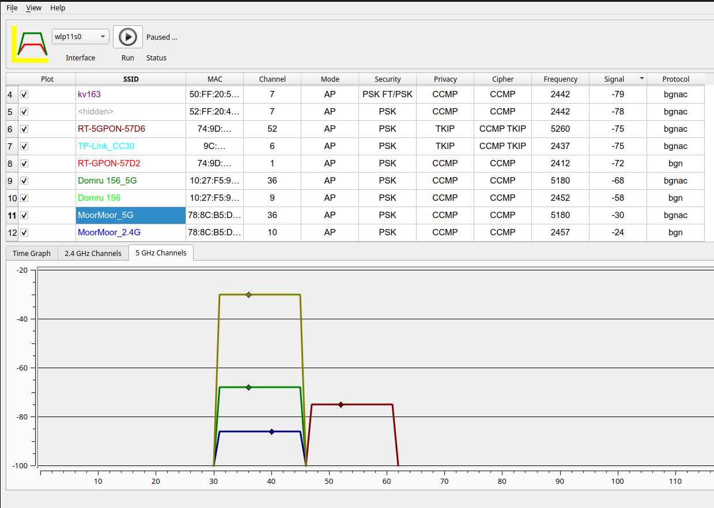
Рис. 2 - карта каналов сети, поулченная программой LinSSID

## Определение максимальной скорости передачи 
Роутер использует стандарт 802.11ac со скоростью передачи до 867 Мбит/с на  5 ГГц. Из того, что я узнал про работу сетей Wi-Fi, я могу сделать предположение, что реальная скорость будет на ~30% ниже, т.е ~600 Мбит/с. Трафик между нашими двумя устройствами будет пересекать воздух дважды: один раз от источника к точке доступа, а затем снова от точки доступа к месту назначения. Таким образом, мы сможем получить только половину пропускной способности. Ситуация бы поменялась в лучшую сторону, если бы мы подключили ПК к точке доступа через гигабитный Ethernet.

Итак, скорость PHY 867 Мбит/с за вычетом типичных ~30% накладных расходов Wi-Fi составляет около 600 Мбит/с, разделенных пополам из-за беспроводного соединения в одном диапазоне одной и той же точки доступа, и мы получаем **максмиум 300 Мбит/с** при отличных условиях радиосигнал:шум.

# Методы измерения скорости соединения 

## Iperf

IPerf — это инструмент для активных измерений максимальной достижимой пропускной способности в IP-сетях. Iperf поддерживает два режима тестировки - Upload и Download. Я написал python и bash скрипты, которые запускают эту программу и парсят её вывод, формируя csv файл с данными о скорости соединения. 

## Python-скрипт для мониторинга сетевого интерфейса
Используем скрипт из прошлого эксперимента. Он отслеживает изменения TX packets и RX packets выбранного сетевого интерфейса. Свою статистику он пишет в .csv файл, который затем можно использовать для анализа. 

## Нагрузка сети

### HHTP Сервер на Python (Flask)

Я написал простой HTTP сервер, через который клиенты могут скачивать файлы с сервера (По TCP). Сервер будет запущен на ПК, а скачивание будет происходить через браузер на ноутбуке. 

# Эксперимент

Вот ход нашего эксперимента:

Часть1:
1. Запустить сервер на ПК, а на ноутбуке начать скачивание файлов
2. Запустить мониторинг соединения

Часть2: 
1. Запустить Ipref скрипт на Upload 
2. Запустить Ipref скрипт на Download

Затем сменить локацию ноутбука и поворить обе части. 

### Ожидания
1. Скорость входящего/исходящего трафика будет на уровне 240-260 Мбит/c. 
2. Изменение локации ноутбука не сильно скажется на скорости соединения.
3. Python сервер лучше справится с нагрузкой сети. 

Будут проведены следующие измерения:

1. Iperf - ноутбук рядом с ротуером, Upload: ноутбук стоит вплотную к роутеру
2. Iperf - ноутбук рядом с ротуером, Download
3. Iperf - ноутбук рядом с ПК, Download: ноутбук стоит на столе рядом с ПК
4. Iperf - ноутбук рядом с ПК, Download
5. HTTP Server - ноутбук рядом с ротуером Upload
5. HTTP Server - ноутбук рядом с ПК Upload

Для удобства наблюдений графики идут немного в другом порядке, чтобы было легче сравнивать результаты. Названия оставлены те же. 

## Iperf 1 - ноутбук рядом с ротуером, Upload
<table><tr>
<td> 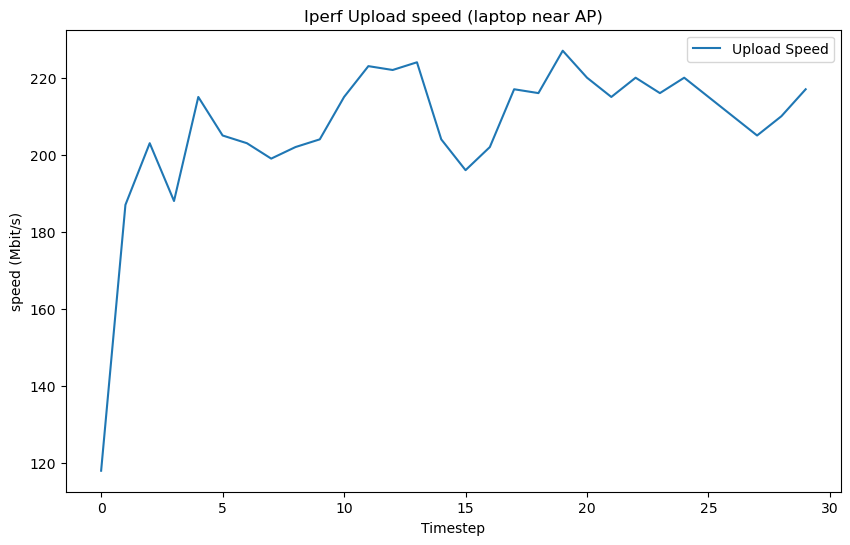 </td>
<td> 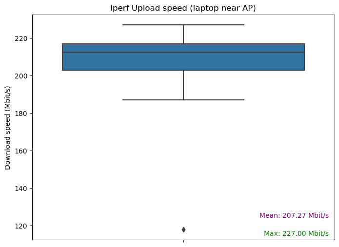 </td>
</tr></table>

## Iperf 2 - ноутбук рядом с ПК, Upload
<table><tr>
<td> 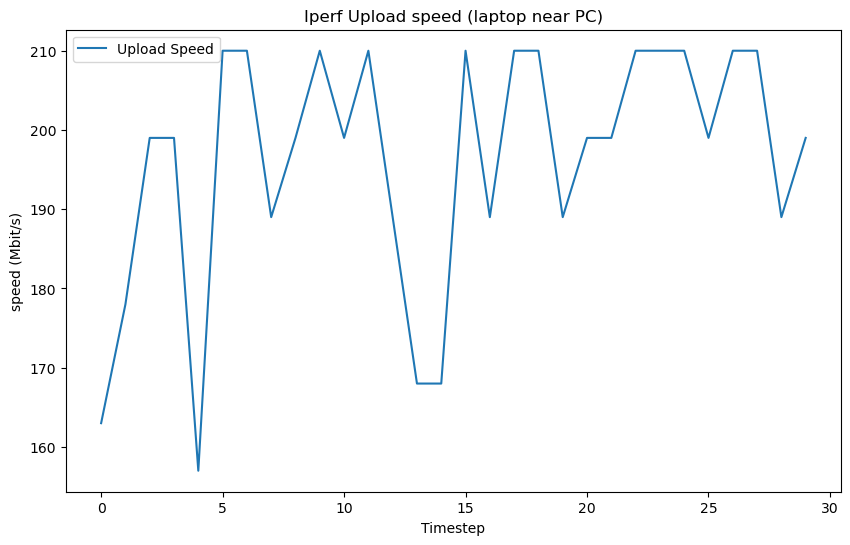 </td>
<td> 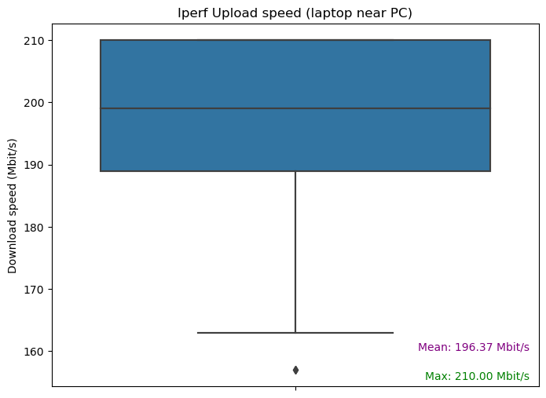 </td>
</tr></table>

## Iperf 3 - ноутбук рядом с ротуером, Download
<table><tr>
<td> 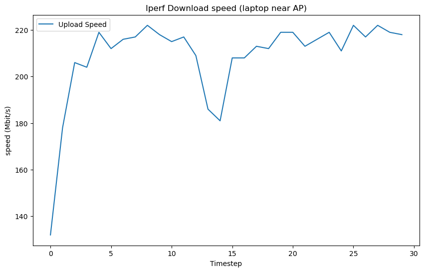 </td>
<td> 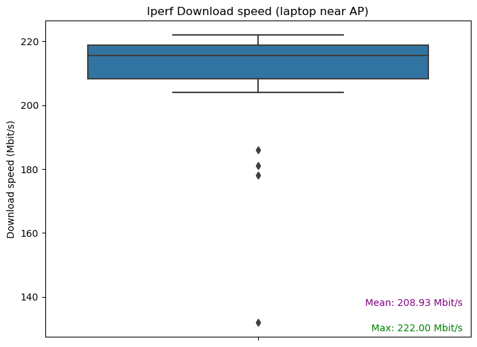 </td>
</tr></table>

## Iperf 4 - ноутбук рядом с ПК, Download
<table><tr>
<td> 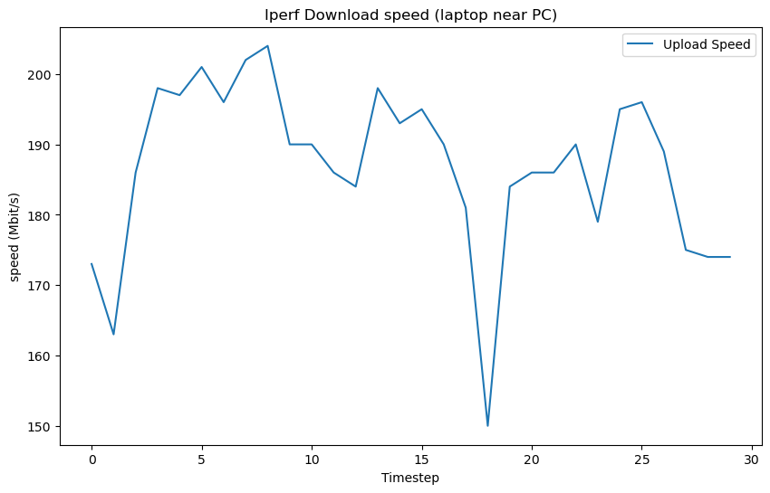 </td>
<td> 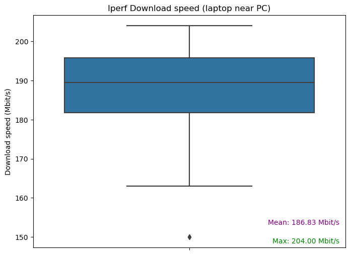 </td>
</tr></table>

## HTTP Server 1 - ноутбук рядом с ротуером Upload
<table><tr>
<td> 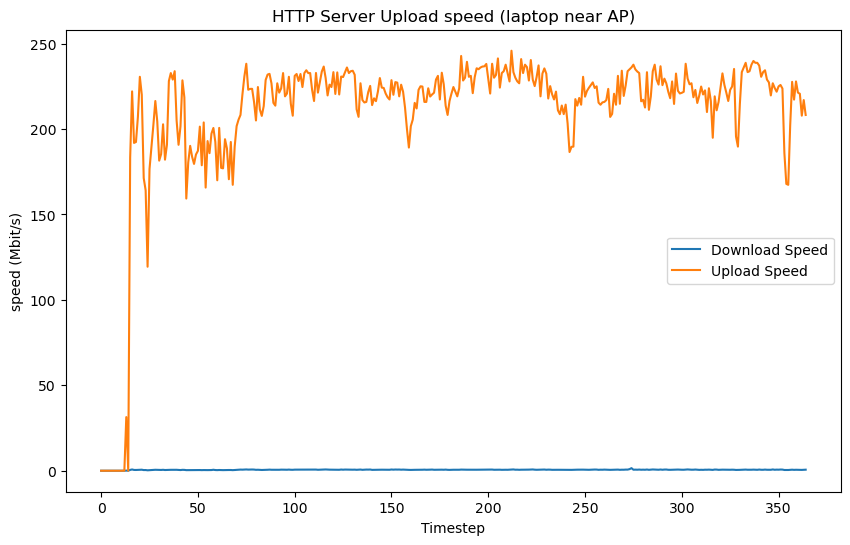 </td>
<td> 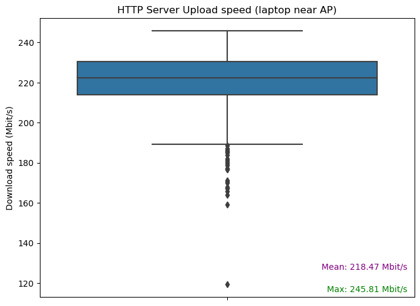 </td>
</tr></table>

## HTTP Server 2 - ноутбук рядом с ПК Upload
<table><tr>
<td> 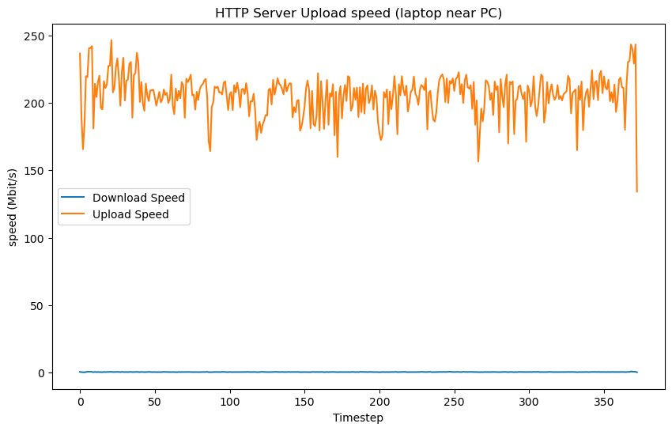 </td>
<td> 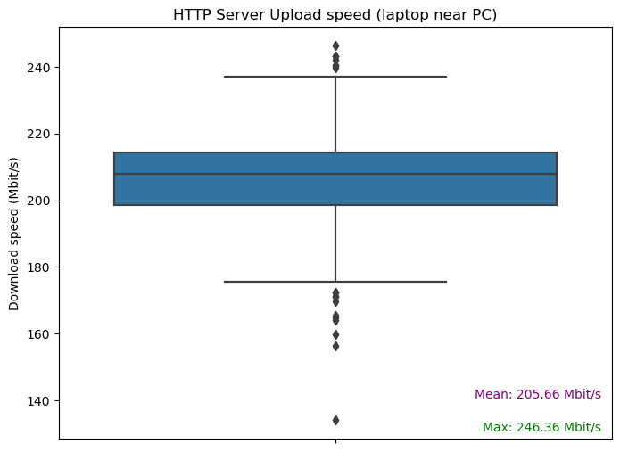 </td>
</tr></table>

# Анализ результатов эксперимента

## Самый эффективный способ нагрузки
Python-сервер смог лучше загрузить сеть, чем Iperf.  

## Скорость в сети
К сожалению, мы не смогли приблизиться к скорости 300 Мбит/с. Полученные результаты оказались  даже ниже ожидаемых - большую часть времени скорость держалась на уровне 200-210 Мбит/c. 

**Максимальная DownloadSpeed:** 222.0 Mbit/s

**Максимальная UploadSpeed:** 246.36 Mbit/s

## Влияние локации ноутбука на скорость
Изменение локации ноутбука действительно не сильно сказалось на скорости трафика.

# Что являлось узким местом в эксперименте

Узким местом  оказался Wi-Fi роутер. Несмотря на заявленную максимальную скорость передачи данных до 867 Мбит/с на частоте 5 ГГц, реальная скорость в эксперименте оказалась ниже ожидаемой. Опять же, подключение ПК к роутеру через Ethernet должно было бы сильно улучшить ситуацию. . 

